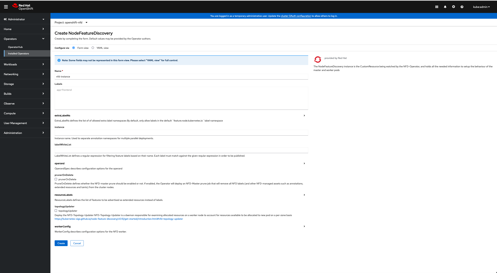
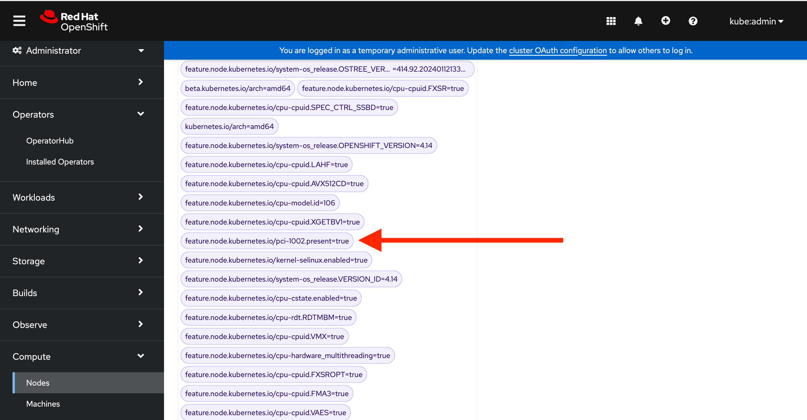

# AMD GPU operator

  Explore the power of AMD Instinct GPU accelerators within your OpenShift cluster with the AMD GPU Operator. This documentation is your go-to resource to enable, configure, and run accelerated workloads with your AMD Instinct GPU accelerators. The AMD GPU Operator lets you seamlessly harness computing capabilities for machine learning, Generative AI, and GPU-accelerated applications.

## Overview of the AMD GPU operator installation

The AMD GPU Operator is distributed in the community OperatorHub and is usable from the OpenShift console.

To install the AMD community release, an OpenShift administrator has to follow these steps:

|	User interface	|	Step description |
|-----------------------|---------------------------|
|	OpenShift CLI	|	Create the internal registry |
|	OpenShift CLI	|	Blacklist the inbox drivers with a MachineConfig|
|	OpenShift Console	|	Install the Node Feature Discovery Operator |
|	OpenShift Console	|	Install the Kernel Module Management Operator |
|	OpenShift Console	|	Install the AMD GPU Operator |

We have one OpenShift cluster deployed (Single Node OpenShift, here):
```bash
laptop ~ % oc get nodes
NAME                                    STATUS   ROLES                         AGE   VERSION
worker0.example.com   Ready    control-plane,master,worker   35m   v1.27.9+e36e183
```

We are using Red Hat OpenShift 4.14:
```bash
laptop ~ % oc get clusterversion
NAME      VERSION   AVAILABLE   PROGRESSING   SINCE   STATUS
version   4.14.10   True        False         18m     Cluster version is 4.14.10
```

We can see that one AMD MI210 GPU accelerator is available on the node:
```bash
laptop ~ % oc debug node/worker0.example.com   

sh-4.4# chroot /host

sh-5.1# lspci | grep -i MI210
b3:00.0 Display controller: Advanced Micro Devices, Inc. [AMD/ATI] Aldebaran/MI200 [Instinct MI210] (rev 02)

sh-5.1# exit
exit

sh-4.4# exit
exit

Removing debug pod ...
```

The AMD GPU Operator will build and deploy the latest ROCm 6 drivers release:
[https://rocm.docs.amd.com/en/latest/deploy/linux/os-native/install.html](https://rocm.docs.amd.com/en/latest/deploy/linux/os-native/install.html)

## Create the internal registry

Check before, we don’t have an internal registry:
```bash
laptop ~ % oc get pods -n openshift-image-registry
NAME                                               READY   STATUS    RESTARTS   AGE
cluster-image-registry-operator-79ffc48786-crfkc   1/1     Running   0          37m
node-ca-nsknt                                      1/1     Running   0          20m
```

Configure the storage of the local image registry:
```bash
laptop ~ % oc patch configs.imageregistry.operator.openshift.io cluster --type merge --patch '{"spec":{"storage":{"emptyDir":{}}}}'
config.imageregistry.operator.openshift.io/cluster patched
```

Enable the local image registry:
```bash
laptop ~ % oc patch configs.imageregistry.operator.openshift.io cluster --type merge --patch '{"spec":{"managementState":"Managed"}}'
config.imageregistry.operator.openshift.io/cluster patched
```

The image registry is running:
```bash
laptop ~ % oc get pods -n openshift-image-registry    
NAME                                               READY   STATUS    RESTARTS   AGE
cluster-image-registry-operator-79ffc48786-crfkc   1/1     Running   0          57m
image-registry-749f6bf957-2jqtj                    1/1     Running   0          87s
node-ca-nsknt                                      1/1     Running   0          41m
```

## Blacklist the inbox drivers with a MachineConfig

We have, by default, the inbox amd drivers loaded:

```bash
laptop ~ % oc debug node/worker0.example.com            

sh-4.4# chroot /host

sh-5.1# lsmod | grep amd
amdgpu               9494528  0
iommu_v2               24576  1 amdgpu
gpu_sched              49152  1 amdgpu
drm_buddy              20480  1 amdgpu
drm_display_helper    172032  1 amdgpu
drm_ttm_helper         16384  1 amdgpu
i2c_algo_bit           16384  2 mgag200,amdgpu
ttm                    90112  2 amdgpu,drm_ttm_helper
drm_kms_helper        192512  5 drm_display_helper,mgag200,amdgpu
drm                   581632  10 gpu_sched,drm_kms_helper,drm_shmem_helper,drm_display_helper,mgag200,drm_buddy,amdgpu,drm_ttm_helper,ttm
```

No /etc/modprobe.d/amdgpu-blacklist.conf file created for now:
```bash
sh-5.1# ls /etc/modprobe.d/amdgpu-blacklist.conf
ls: cannot access '/etc/modprobe.d/amdgpu-blacklist.conf': No such file or directory

sh-5.1# exit
exit

sh-4.4# exit
exit

Removing debug pod ...
```

We prepare the `1-blacklist.yml` yaml file. You should set `master` for the label `machineconfiguration.openshift.io/role` if you run Single Node OpenShift or `worker` in other scenarios with dedicated controllers.
```bash
laptop ~ % cat <<EOF > 1-blacklist.yml  
apiVersion: machineconfiguration.openshift.io/v1
kind: MachineConfig
metadata:
  labels:
    machineconfiguration.openshift.io/role: worker
  name: amdgpu-module-blacklist
spec:
  config:
    ignition:
      version: 3.2.0
    storage:
      files:
        - path: "/etc/modprobe.d/amdgpu-blacklist.conf"
          mode: 420
          overwrite: true
          contents:
            source: "data:text/plain;base64,YmxhY2tsaXN0IGFtZGdwdQo="
EOF
```

We apply the blacklist Machine Config for the inbox AMD GPU driver:
```bash
laptop ~ % oc apply -f 1-blacklist.yml
machineconfig.machineconfiguration.openshift.io/amdgpu-module-blacklist created
```

We can see the machineconfig runnning:
```bash
laptop ~ % oc get machineconfigs | grep amdgpu-module-blacklist
amdgpu-module-blacklist                                                                       3.2.0             12s
```

The MachineConfig will trigger a reboot, you can ping your host to follow the reboot.

After the reboot, we can connect to the node and see that the blacklist file is created:
```bash
laptop ~ % oc debug node/worker0.example.com

sh-4.4# chroot /host

sh-5.1# ls /etc/modprobe.d/amdgpu-blacklist.conf
/etc/modprobe.d/amdgpu-blacklist.conf
```

No amd modules are loaded after the reboot:
```bash
sh-5.1# lsmod | grep amd

sh-5.1# exit
exit

sh-4.4# exit
exit

Removing debug pod ...
```

## Install the Node Feature Discovery Operator

In the OpenShift Console, in `Operators` > `OperatorHub` search: `nfd`


Click on `Node Feature Discovery Operator` tagged `Red Hat`.


Click on `Install`.


Click on `Install`.


Click on `View Operator`.

Create the NFD instance:


Click on `Create Instance`.



Click on `Create`.

The `Node Feature Discovery Operator` is installed.

You can see the NFD label in `Compute` > `Node` > your node > `Details` tab, you should see:
`feature.node.kubernetes.io/pci-1002.present=true`



We can also see the label with one oc command:
```bash
laptop ~ % oc describe nodes | grep pci-1002.present
                    feature.node.kubernetes.io/pci-1002.present=true
```

## Install the Kernel Module Management Operator


Click on the `Kernel Module Management` (not the one called `Hub`).


Click on `Install`.


Click on `Install`.

The operator is installed:


To verify that the Operator deployment is successful, run the following command:
```bash
laptop ~ % oc get -n openshift-kmm pods   
NAME                                       READY   STATUS    RESTARTS   AGE
kmm-operator-controller-5f675cdf94-wk2ff   2/2     Running   0          65s
```

The `Kernel Module Management Operator` is installed and ready to be used by the `AMD GPU Operator`.

## Install the AMD GPU operator

Check before:
```bash
laptop ~ % oc get pods -n openshift-amd-gpu  
No resources found in openshift-amd-gpu namespace.
```

The worker nodes with AMD GPUs are not labeled, for now, with `amd.com/gpu` to schedule AMD GPU accelerated pods:
```bash
laptop ~ %  oc describe node | egrep "Resource.*Requests|amd.com/gpu"
  Resource           Requests      Limits
```


Click on `AMD GPU Operator`.


Click on `Continue`.


Click on `Install`.


Click on `Install`.


Click on `View Operator`.

Check if the operator has created the `amd-gpu-operator-controller-manager`:
```bash
laptop ~ % oc get pods -n openshift-amd-gpu  
NAME                                                   READY   STATUS    RESTARTS   AGE
amd-gpu-operator-controller-manager-5c58556d57-6xlwt   2/2     Running   0          80s
```


Click on `Create instance`.


Click on `Create`.

A build is starting and is building the AMD GPU driver:
```bash
laptop ~ % oc get pods -n openshift-amd-gpu  
NAME                                                   READY   STATUS    RESTARTS   AGE
amd-gpu-operator-controller-manager-5c58556d57-6xlwt   2/2     Running   0          117s
dc-internal-registry-build-5rltr-build                 1/1     Running   0          37s
```
We can follow the AMD drivers build logs:
```bash
laptop ~ % oc logs dc-internal-registry-build-5rltr-build -n openshift-amd-gpu -f
...
  CC [M]  /amdgpu-drivers-source/amd/amdgpu/si_dma.o
  CC [M]  /amdgpu-drivers-source/amd/amdgpu/dce_v6_0.o
  CC [M]  /amdgpu-drivers-source/amd/amdgpu/uvd_v3_1.o
...
Writing manifest to image destination
Successfully pushed image-registry.openshift-image-registry.svc:5000/openshift-amd-gpu/amd_gpu_kmm_modules@sha256:a66912cb3c22fe561c1ffbc8e2c5bb5b05199353ff2afaf20390a6412d3bfa68
Push successful
```

You can find the `amd.com/gpu` resources to schedule your AMD-GPU-accelerated pods:
```bash
laptop ~ % oc describe node | egrep "Resource.*Requests|amd.com/gpu"  
  amd.com/gpu:        1
  amd.com/gpu:        1
  Resource           Requests      Limits
  amd.com/gpu        0             0
```

## Test the AMD GPU Operator

### Test rocm-smi

Prepare the yaml file:
```
laptop % cat << EOF > rocm-smi.yaml
apiVersion: v1
kind: Pod
metadata:
 name: rocm-smi
spec:
 containers:
 - image: docker.io/rocm/pytorch:latest
   name: rocm-smi
   command: ["/bin/sh","-c"]
   args: ["rocm-smi"]
   resources:
    limits:
      amd.com/gpu: 1
    requests:
      amd.com/gpu: 1
 restartPolicy: Never
EOF
```

Create the rocm-smi pod:
```bash
laptop ~ % oc create -f rocm-smi.yaml
pod/rocm-smi created
```

Check rocm-smi log with one MI210 GPU:
```bash
laptop ~ % oc get pods
NAME        READY   STATUS      RESTARTS   AGE
rocm-smi   0/1     Completed   0           40s
```

Check the logs:
```bash
laptop ~ % oc logs pod/rocm-smi
====================================== ROCm System Management Interface ======================================
================================================ Concise Info ================================================
Device  [Model : Revision]    Temp    Power  Partitions      SCLK    MCLK     Fan  Perf  PwrCap  VRAM%  GPU%  
        Name (20 chars)       (Edge)  (Avg)  (Mem, Compute)                                                   
==============================================================================================================
0       [0x0c34 : 0x02]       32.0°C  38.0W  N/A, N/A        800Mhz  1600Mhz  0%   auto  300.0W    0%   0%    
        Instinct MI210                                                                                        
==============================================================================================================
============================================ End of ROCm SMI Log =============================================

laptop ~ % oc delete -f rocm-smi.yaml
pod "rocm-smi" deleted
```

## Test rocminfo

Prepare the yaml file:
```bash
laptop % cat << EOF > rocminfo.yaml
apiVersion: v1
kind: Pod
metadata:
 name: rocminfo
spec:
 containers:
 - image: docker.io/rocm/pytorch:latest
   name: rocminfo
   command: ["/bin/sh","-c"]
   args: ["rocminfo"]
   resources:
    limits:
      amd.com/gpu: 1
    requests:
      amd.com/gpu: 1
 restartPolicy: Never
EOF
```

Create the rocminfo pod:
```bash
laptop % oc create -f rocminfo.yaml
apiVersion: v1
pod/rocminfo created
```

Check the rocminfo logs with one MI210 GPU:
```bash
laptop ~ % oc logs rocminfo | grep -A5 "Agent"
HSA Agents               
==========               
*******                  
Agent 1                  
*******                  
  Name:                    Intel(R) Xeon(R) Gold 6330 CPU @ 2.00GHz
  Uuid:                    CPU-XX                             
  Marketing Name:          Intel(R) Xeon(R) Gold 6330 CPU @ 2.00GHz
  Vendor Name:             CPU                                
--
Agent 2                  
*******                  
  Name:                    Intel(R) Xeon(R) Gold 6330 CPU @ 2.00GHz
  Uuid:                    CPU-XX                             
  Marketing Name:          Intel(R) Xeon(R) Gold 6330 CPU @ 2.00GHz
  Vendor Name:             CPU                                
--
Agent 3                  
*******                  
  Name:                    gfx90a                             
  Uuid:                    GPU-024b776f768a638b               
  Marketing Name:          AMD Instinct MI210                 
  Vendor Name:             AMD                     

laptop ~ % oc delete -f rocminfo.yaml
```
