# AMD GPU operator

  Explore the power of AMD Instinct GPU accelerators within your OpenShift cluster with the AMD GPU Operator. This documentation is your go-to resource to enable, configure, and run accelerated workloads with your AMD Instinct GPU accelerators. The AMD GPU Operator lets you seamlessly harness computing capabilities for machine learning, Generative AI, and GPU-accelerated applications.

## Overview of the AMD GPU operator installation

The AMD GPU Operator is distributed in the community OperatorHub and is usable from the OpenShift console.

To install the AMD community release, an OpenShift administrator has to follow these steps:

|	User interface	|	Step description |
|-----------------------|---------------------------|
|	OpenShift CLI	|	Create the internal registry |
|	OpenShift CLI	|	Blacklist the inbox drivers with a MachineConfig|
|	OpenShift CLI	|	Install the Kernel Module Management Operator 2.0.1 pre-release with an external catalog |
|	OpenShift Console	|	Deploy NFD |
|	OpenShift Console	|	Deploy KMM operator |
|	OpenShift Console	|	Install the AMD GPU Operator |

We have one OpenShift cluster deployed (Single Node OpenShift for example):
```bash
laptop ~ % oc get nodes
NAME                                    STATUS   ROLES                         AGE   VERSION
worker0.example.com   Ready    control-plane,master,worker   14h   v1.27.8+4fab27b
```

OpenShift is running:
```bash
laptop ~ % oc get nodes
NAME                                    STATUS   ROLES                         AGE   VERSION
worker0.example.com   Ready    control-plane,master,worker   14h   v1.27.8+4fab27b

laptop ~ % oc get clusterversion
NAME      VERSION   AVAILABLE   PROGRESSING   SINCE   STATUS
version   4.14.8    True        False         14h     Cluster version is 4.14.8
```

We can see that one MI210 GPU accelerator is available on the node:
```bash
[core@worker0 ~]$ lspci | grep -i MI210
19:00.0 Display controller: Advanced Micro Devices, Inc. [AMD/ATI] Aldebaran/MI200 [Instinct MI210] (rev 02)
```

We will build and deploy the latest ROCm 6 drivers release:
[https://rocm.docs.amd.com/en/latest/deploy/linux/os-native/install.html](https://rocm.docs.amd.com/en/latest/deploy/linux/os-native/install.html)

## Create the internal registry

Check before, we don’t have an internal registry:
```bash
laptop ~ %  oc get pods -n openshift-image-registry

NAME                                               READY   STATUS      RESTARTS   AGE
cluster-image-registry-operator-74cbd85779-hg5rs   1/1     Running     1          15h
image-pruner-28432800-v2hjd                        0/1     Completed   0          9h
node-ca-27wlv                                      1/1     Running     1          14h
```

Enable the internal registry:
```bash
laptop ~ %  oc patch configs.imageregistry.operator.openshift.io cluster --type merge --patch '{"spec":{"managementState":"Managed"}}'
```

The registry in running:
```bash
laptop ~ %  oc get pods -n openshift-image-registry  
NAME                                               READY   STATUS      RESTARTS   AGE
cluster-image-registry-operator-74cbd85779-hg5rs   1/1     Running     1          15h
image-pruner-28432800-v2hjd                        0/1     Completed   0          9h
image-registry-68b4f9ccc-bg68k                     0/1     Running     0          8s
image-registry-f669759f4-95gsz                     0/1     Running     0          9s
node-ca-27wlv                                      1/1     Running     1          14h
                                    1/1     Running       1          21d
```

## Blacklist the inbox drivers with a MachineConfig

We have by default the inbox amd drivers loaded:

```bash
[core@worker0 ~]$ lsmod | grep amd
amdgpu               9494528  0
iommu_v2               24576  1 amdgpu
gpu_sched              49152  1 amdgpu
drm_buddy              20480  1 amdgpu
drm_display_helper    172032  1 amdgpu
drm_ttm_helper         16384  1 amdgpu
ttm                    90112  2 amdgpu,drm_ttm_helper
i2c_algo_bit           16384  2 mgag200,amdgpu
drm_kms_helper        192512  5 drm_display_helper,mgag200,amdgpu
drm                   581632  10 gpu_sched,drm_kms_helper,drm_shmem_helper,drm_display_helper,mgag200,drm_buddy,amdgpu,drm_ttm_helper,ttm
```

No /etc/modprobe.d/amdgpu-blacklist.conf file created for now:
```bash
[core@worker0 ~]$ ls /etc/modprobe.d/amdgpu-blacklist.conf
ls: cannot access '/etc/modprobe.d/amdgpu-blacklist.conf': No such file or directory
```

We prepare the 1-blacklist.yml yaml file:
```bash
laptop ~ % cat <<EOF > 1-blacklist.yml  
apiVersion: machineconfiguration.openshift.io/v1
kind: MachineConfig
metadata:
  labels:
    machineconfiguration.openshift.io/role: worker
  name: amdgpu-module-blacklist
spec:
  config:
    ignition:
      version: 3.2.0
    storage:
      files:
        - path: "/etc/modprobe.d/amdgpu-blacklist.conf"
          mode: 420
          overwrite: true
          contents:
            source: "data:text/plain;base64,YmxhY2tsaXN0IGFtZGdwdQo="
EOF
```

We apply the blacklist Machine Config for the inbox GPU driver:

```bash
laptop ~ % oc apply -f 1-blacklist.yml
machineconfig.machineconfiguration.openshift.io/amdgpu-module-blacklist created
```

The MachineConfig will trigger a reboot.
After the reboot, we can connect to the node and see that the blacklist file is created:

```bash
[core@worker0 ~]$ ls /etc/modprobe.d/amdgpu-blacklist.conf
/etc/modprobe.d/amdgpu-blacklist.conf
```

No amd modules are loaded after the reboot:

```bash
[core@worker0 ~]$ lsmod | grep amd
[core@worker0 ~]$
```

## Install the Kernel Module Management Operator 2.0.1 pre-release

Check the “kernel module management” status before in the catalog configuration.

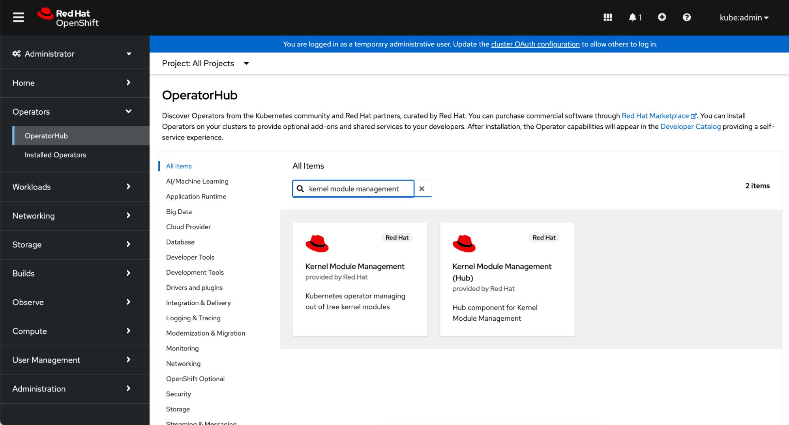

Prepare the catalog configuration:
```bash
laptop ~ % cat <<EOF > 2-catalog-kmm-2.0.1.yml
apiVersion: operators.coreos.com/v1alpha1
kind: CatalogSource
metadata:
  name: kmm-test
  namespace: openshift-marketplace
spec:
  sourceType: grpc
  image: quay.io/yshnaidm/kernel-module-management-index:amd-gpu
  displayName: KMM operator
  publisher: yshnaidm
EOF
```

Apply the KMM 2.0.1 catalog beta source:

```bash
laptop ~ % oc apply -f 2-catalog-kmm-2.0.1.yml
catalogsource.operators.coreos.com/kmm-test created
```

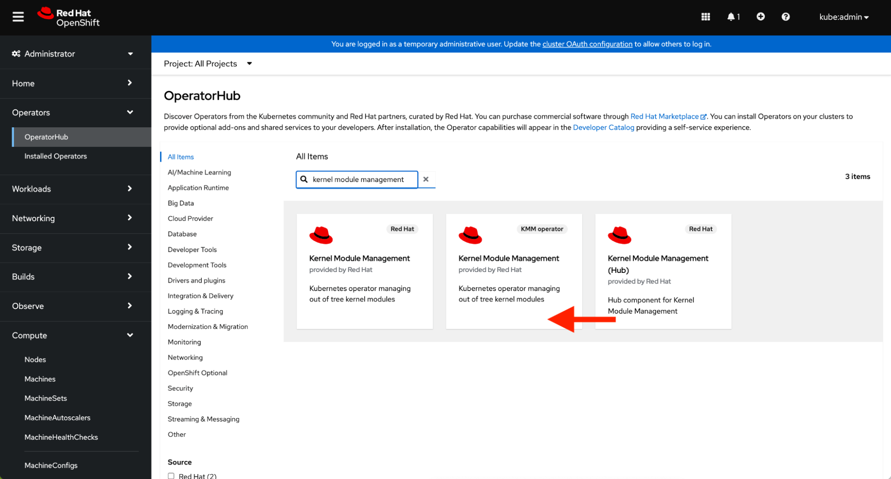
Click on the one tagged “KMM operator”.

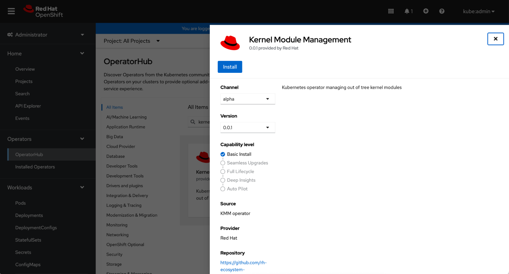

Click on “Install”.

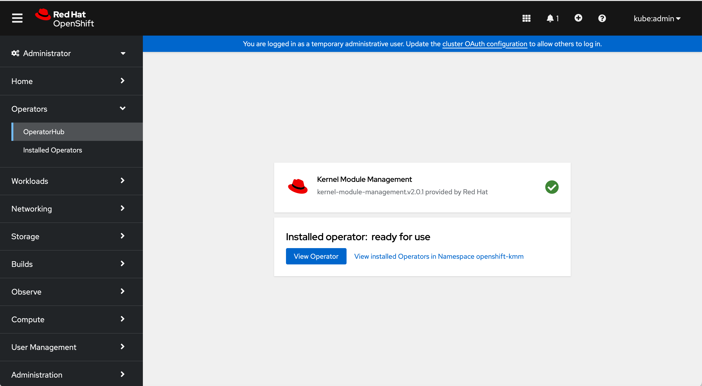

To verify that the Operator deployment is successful, run the following command:
```bash
laptop ~ % oc get -n openshift-kmm pods         
NAME                                      READY   STATUS    RESTARTS   AGE
kmm-operator-controller-85c7998f9-6mtw6   1/1     Running   0          76s
```

Kernel Module Management Operator is installed and ready to be used by the AMD GPU Operator.

## Install the Node Feature Discovery Operator

In the OpenShift Console, in Operators > OperatorHub search: “Node Feature Discovery”


Click on “Node Feature Discovery”.

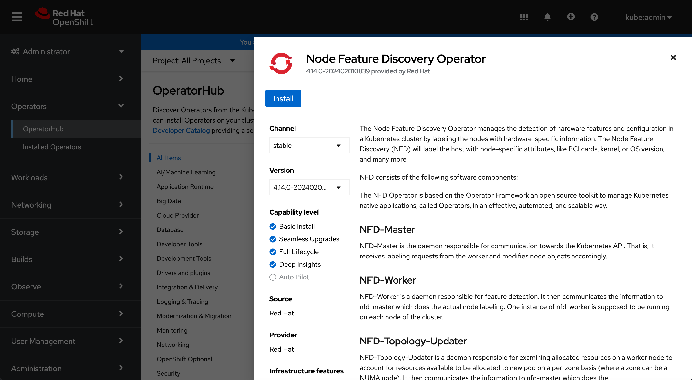
Click on “install”.

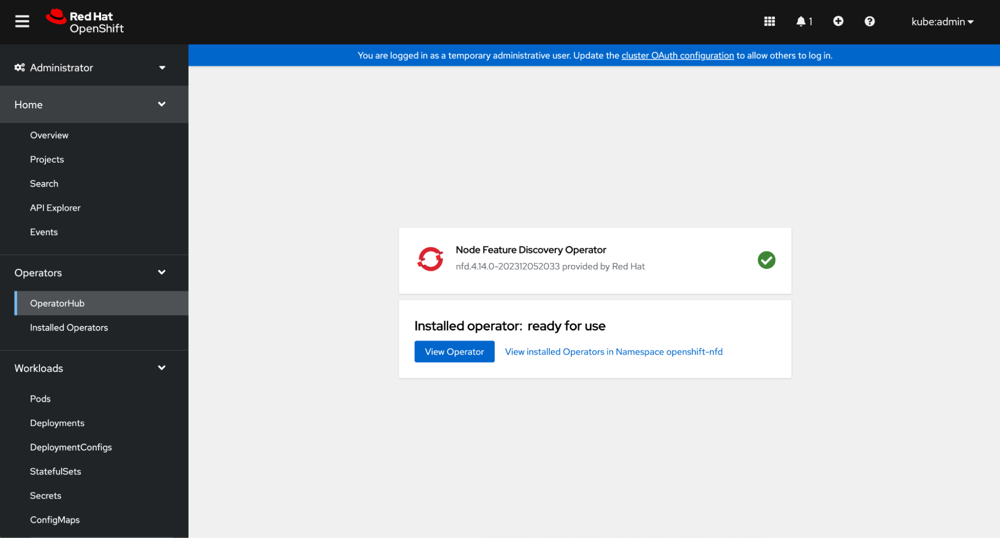
Click on “View Operator”.

Create the NFD instance:

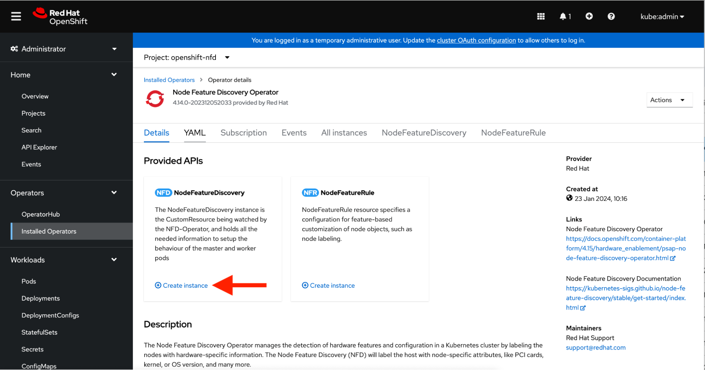
Click on “Create Instance”.

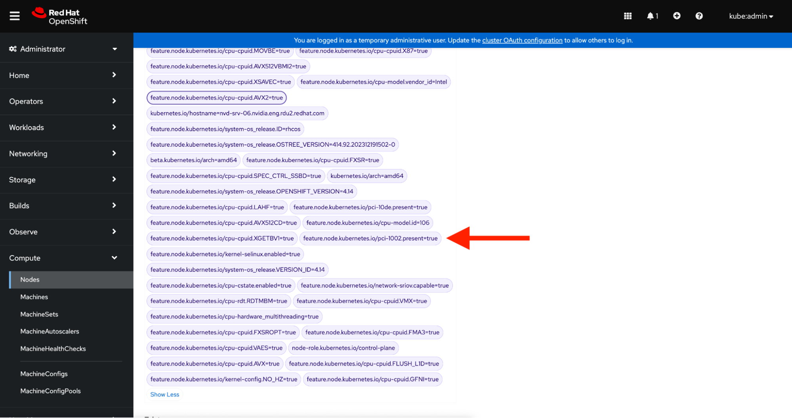

You can see the NFD label `feature.node.kubernetes.io/pci-1002.present=true`

We can also see the label with one oc command:
```bash
laptop ~ %  oc describe nodes | grep pci-1002.present
                    feature.node.kubernetes.io/pci-1002.present=true
```

## Install the AMD-GPU operator

Check before:
```bash
laptop ~ % oc get pods -n openshift-amd-gpu  
No resources found in openshift-amd-gpu namespace.
```

Node not labeled with “amd.com/gpu” to schedule AMD gpu accelerated pods:
```bash
laptop ~ %  oc describe node | egrep "Resource.*Requests|amd.com/gpu"
  Resource           Requests      Limits
```

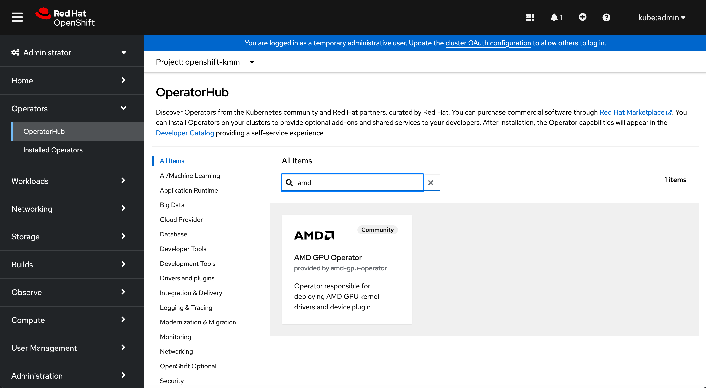
Click on "AMD GPU Operator".

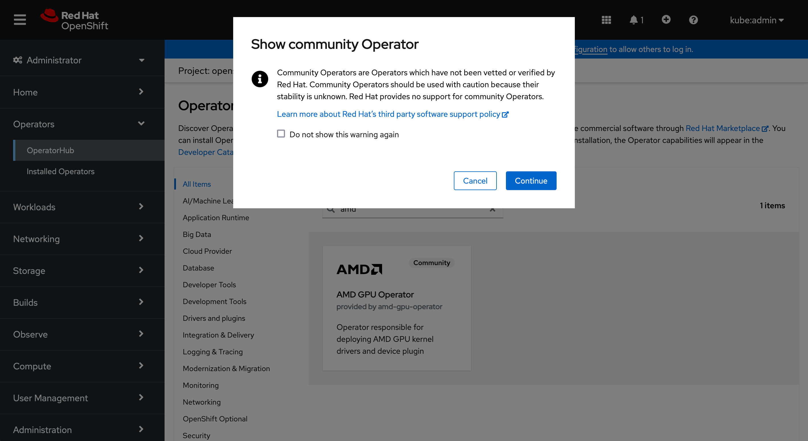
Click on "Install".

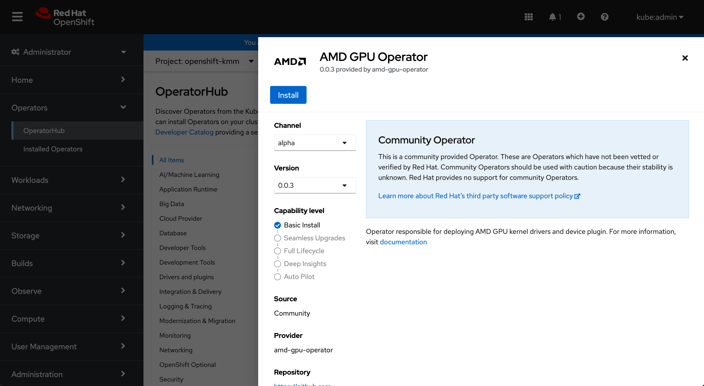
Click on "Continue".

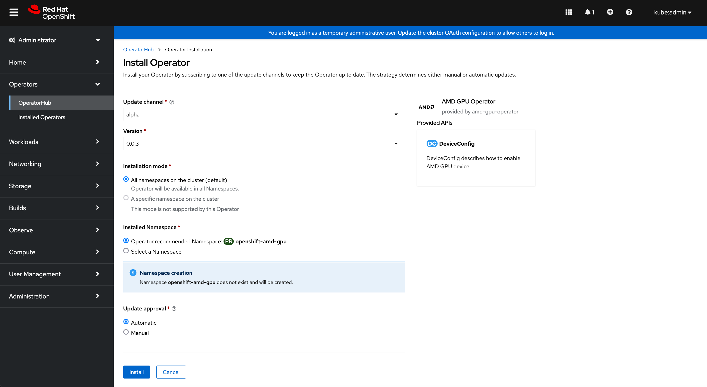
Click on "Install".

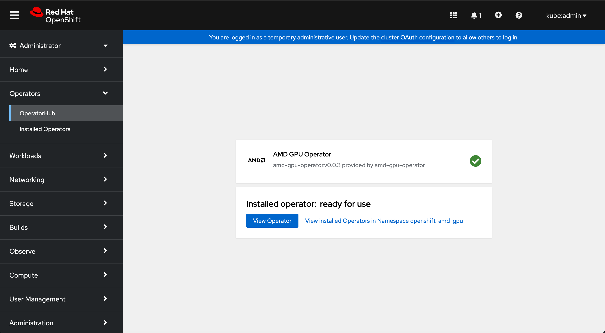
Click on "View Operator".

Check if the operator has created the amd-gpu-operator-controller-manager:
```bash
laptop ~ %  oc get pods -n openshift-amd-gpu  

NAME                                                  READY   STATUS    RESTARTS   AGE
amd-gpu-operator-controller-manager-988c47468-f4c9l   2/2     Running   0          2m22s
```

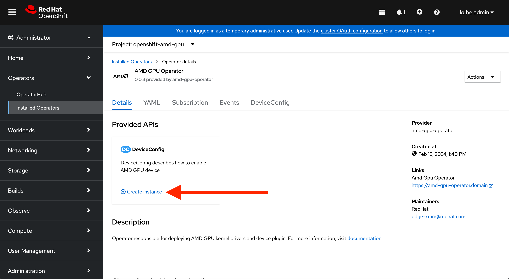
Click on "Create instance".

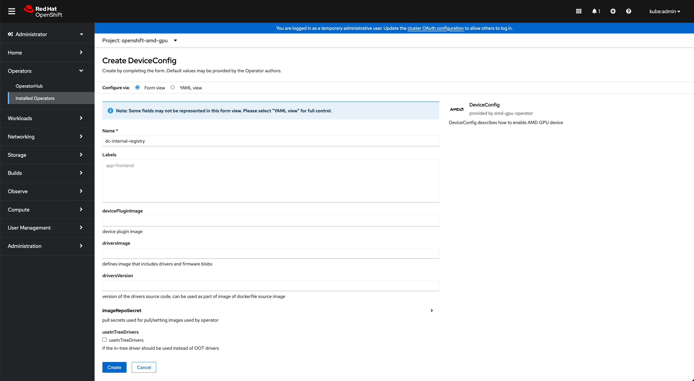
Click on "Create".

A build is starting:
```bash
laptop ~ %  oc get pods -n openshift-amd-gpu         

NAME                                                  READY   STATUS    RESTARTS       AGE
amd-gpu-operator-controller-manager-988c47468-f4c9l   2/2     Running   1 (103s ago)   20m
dc-internal-registry-build-b5lgj-build                1/1     Running   0              24s
```

We can follow the AMD driver build:
```bash
laptop ~ % oc logs dc-internal-registry-build-b5lgj-build -n openshift-amd-gpu -f
…
  CC [M]  /amdgpu-drivers-source/amd/amdgpu/dce_v8_0.o
  CC [M]  /amdgpu-drivers-source/amd/amdgpu/gfx_v7_0.o
  CC [M]  /amdgpu-drivers-source/amd/amdgpu/cik_sdma.o
  CC [M]  /amdgpu-drivers-source/amd/amdgpu/uvd_v4_2.o
  CC [M]  /amdgpu-drivers-source/amd/amdgpu/vce_v2_0.o
  CC [M]  /amdgpu-drivers-source/amd/amdgpu/si.o
  CC [M]  /amdgpu-drivers-source/amd/amdgpu/gmc_v6_0.o
  CC [M]  /amdgpu-drivers-source/amd/amdgpu/gfx_v6_0.o
  CC [M]  /amdgpu-drivers-source/amd/amdgpu/si_ih.o
  CC [M]  /amdgpu-drivers-source/amd/amdgpu/si_dma.o
  CC [M]  /amdgpu-drivers-source/amd/amdgpu/dce_v6_0.o
  CC [M]  /amdgpu-drivers-source/amd/amdgpu/uvd_v3_1.o
```

You can find the custom schedulable resources:
```bash
laptop ~ %  oc describe node | egrep "Resource.*Requests|amd.com/gpu"                               

  amd.com/gpu:        1
  amd.com/gpu:        1
  Resource           Requests      Limits
  amd.com/gpu        0             0
```

## Test the AMD GPU Operator

### Test rocm-smi

Prepare the yaml file:

```
laptop % cat << EOF > rocm-smi.yaml
apiVersion: v1
kind: Pod
metadata:
 name: rocm-smi
spec:
 containers:
 - image: docker.io/rocm/pytorch:latest
   name: rocm-smi
   command: ["/bin/sh","-c"]
   args: ["rocm-smi"]
   resources:
    limits:
      amd.com/gpu: 1
    requests:
      amd.com/gpu: 1
 restartPolicy: Never
EOF
```

Create the rocm-smi pod:
```bash
laptop % oc create -f rocm-smi.yaml
apiVersion: v1
pod/rocm-smi created
```

Check rocm-smi log with one MI210 GPU:
```bash
laptop ~ % oc get pods
NAME        READY   STATUS      RESTARTS   AGE
rocm-smi   0/1     Completed   0          6m28s
```

Check the logs:
```bash
laptop ~ % oc logs pod/rocm-smi
====================================== ROCm System Management Interface ======================================
================================================ Concise Info ================================================
Device  [Model : Revision]    Temp    Power  Partitions      SCLK    MCLK     Fan  Perf  PwrCap  VRAM%  GPU%  
        Name (20 chars)       (Edge)  (Avg)  (Mem, Compute)                                                   
==============================================================================================================
0       [0x0c34 : 0x02]       33.0°C  41.0W  N/A, N/A        800Mhz  1600Mhz  0%   auto  300.0W    0%   0%    
        Instinct MI210                                                                                        
==============================================================================================================
============================================ End of ROCm SMI Log =============================================

laptop ~ % oc delete -f rocm-smi.yaml
pod "rocm-smi" deleted
```

## Test rocminfo

Prepare the yaml file:
```bash
laptop % cat << EOF > rocminfo.yaml
apiVersion: v1
kind: Pod
metadata:
 name: rocminfo
spec:
 containers:
 - image: docker.io/rocm/pytorch:latest
   name: rocminfo
   command: ["/bin/sh","-c"]
   args: ["rocminfo"]
   resources:
    limits:
      amd.com/gpu: 1
    requests:
      amd.com/gpu: 1
 restartPolicy: Never
EOF
```

Create the rocminfo pod:
```bash
laptop % oc create -f rocminfo.yaml
apiVersion: v1
pod/rocminfo created
```

Check rocminfo logs with one MI210 GPU:
```bash
laptop ~ %  oc logs rocminfo | grep -A5 "Agent"

HSA Agents               
==========               
*******                  
Agent 1                  
*******                  
  Name:                    Intel(R) Xeon(R) Gold 6330 CPU @ 2.00GHz
  Uuid:                    CPU-XX                             
  Marketing Name:          Intel(R) Xeon(R) Gold 6330 CPU @ 2.00GHz
  Vendor Name:             CPU                                
--
Agent 2                  
*******                  
  Name:                    Intel(R) Xeon(R) Gold 6330 CPU @ 2.00GHz
  Uuid:                    CPU-XX                             
  Marketing Name:          Intel(R) Xeon(R) Gold 6330 CPU @ 2.00GHz
  Vendor Name:             CPU                                
--
Agent 3                  
*******                  
  Name:                    gfx90a                             
  Uuid:                    GPU-9d0b701f303bba51               
  Marketing Name:          AMD Instinct MI210                 
  Vendor Name:             AMD

laptop ~ % oc delete -f rocminfo.yaml
```
